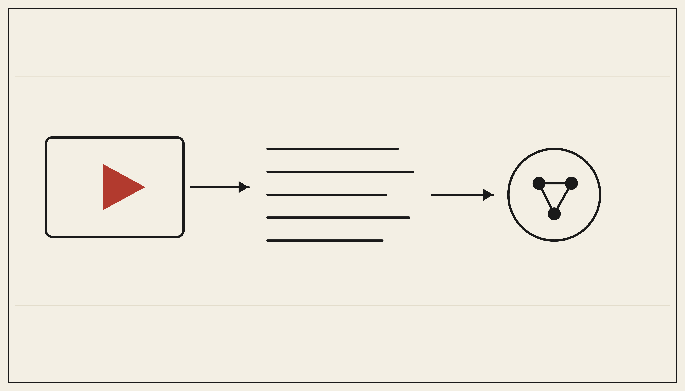

# YouTube Transcript Scraper — Clean Text for AI Agents, No API Key



[](https://apify.com/george.the.developer/youtube-transcript-scraper)
[](https://apify.com/george.the.developer/youtube-transcript-scraper)
[](https://mcp.apify.com)

Turn any YouTube video into clean transcript text, ready for an AI agent, a RAG pipeline, or a summary. No login, no API key, no audio download, no whisper. Point it at a URL, get the words back.

The YouTube Data API does not return transcripts, and the whisper route wastes compute on words that already exist as captions. This skips all of that.

**Run it here:** https://apify.com/george.the.developer/youtube-transcript-scraper

## Turn a video into agent-ready text in 10 minutes

1. Give the actor a video URL, or a batch of them.
2. Run it. Each video returns its transcript as clean text plus basic metadata.
3. Feed the text into your pipeline: chunk and embed for RAG, or pass a single transcript into a prompt for a summary or Q&A.

## Input

```json
{
  "videoUrls": ["https://www.youtube.com/watch?v=dQw4w9WgXcQ"],
  "language": "en"
}
```

## Use it inside Claude or any AI agent (MCP)

```
https://mcp.apify.com?tools=george.the.developer/youtube-transcript-scraper
```

Ask your agent "pull the transcript of this talk and summarize the three main arguments" and it runs the actor, reads the text, and answers. The video becomes one more source your agent can read on demand.

## Who uses this

- Builders of RAG and knowledge tools over video content
- AI agents that summarize or answer questions about talks and tutorials
- Researchers turning a channel or playlist into a searchable corpus
- Anyone who needs clean transcript text without an API key or audio processing

---

Built by George. More data and AI tools: https://apify.com/george.the.developer
